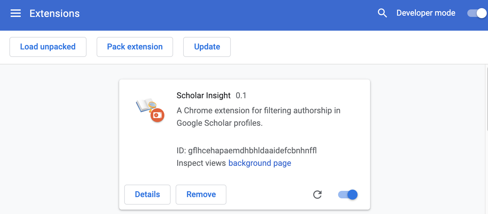
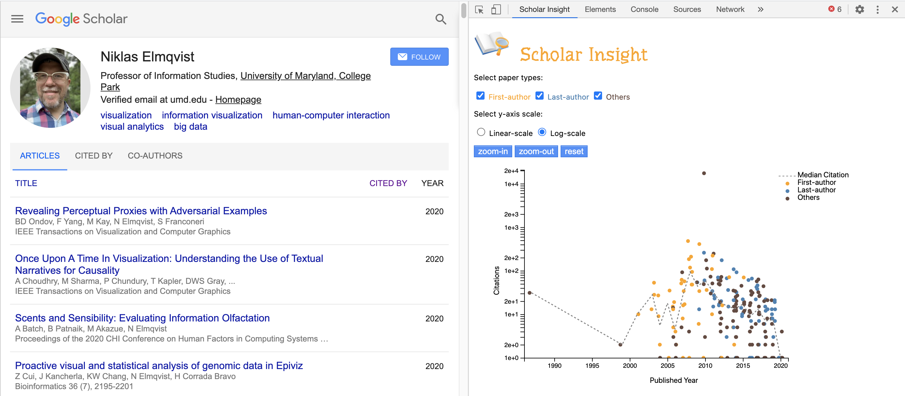
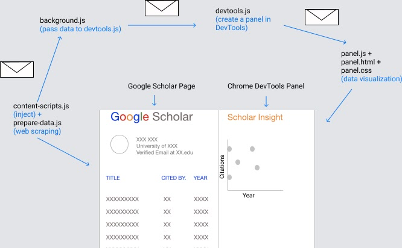

# ScholarInsight

A Chrome Extension for visualizing Google Scholar profiles

## Motivation
It’s a course project for [INST 760](https://sites.umiacs.umd.edu/elm/teaching/inst-760-data-visualization/). A formal writeup is published on [Medium](https://medium.com/visumd/scholarinsight-a-chrome-web-browser-extension-for-visualizing-google-scholar-profiles-f953473d2e87).

## Video Demo
Here is a [video demo](https://youtu.be/7-C5sBFzqNc) on YouTube.

## Setup
1. Go to "chrome://extensions"
2. Turn on "developer's mode" on the top right
3. Click "load unpacked" and upload the source code folder of ScholarInsight.

You should be able to see the following: 

Now you can go to any Google Scholar profile page (in English),

1. Right click => choose "inspect"
2. Click the  ">>" at the end of the row "Elements Console Sources Network"
3. Click "ScholarInsight" 

You should be able to see something similar to this:

## How to use it
ScholarInsight provides several user interactions

1. Filter: users can filter papers by checking/unchecking paper type boxes
2. Scale-transform: users can choose linear or log-scale for citations
3. Zoom/pan: users can either click the zoom buttons or use the mousewheel to zoom; users can also pan the visualization by dragging it.
4. Tooltips: users can hover on a point, and click it to show detailed information about that paper.

## FAQ
_What is the median citation?_

ScholarInsight calculates the median citation of that author for each year, and connects it to a dashed line. Papers above the median citation line are relatively higher cited for that author. 

_What if two papers of the same year have the same citation?_

ScholarInsight jittered the data to avoid overlapping.

## More details: the architecture
The architecture of ScholarInsight is inspired by [D3debugger](https://github.com/eyxiao/d3bugger).

